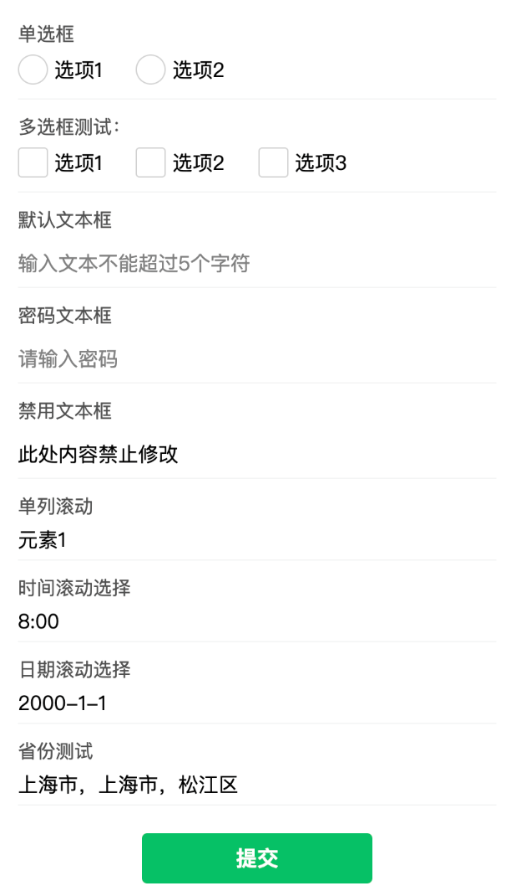

## 使用说明

实现简单的微信小程序原生表单封装，包含的内容可于文件的 `index` 界面内预览



将 `components` 内的组件复制到自己项目内，并在相应界面的 `json` 文件中引用即可，具体代码如下：

```json
{
  "usingComponents": {
    "normalform": "/components/normalform/normalform"
  }
}
```

```html
<normalform formInfo="{{formInfo}}" color="#"  bindformSubmit="formSubmit"></normalform>
```

```js
data:{
	formInfo:[],   // 表单数据，请于文查阅
	color:"#"      // 颜色选项，不传入则为微信默认颜色
},
formSubmit(e){
    console.log(e.detail);  // 获取当前数据并加以使用
 }
```

### formInfo数据传入说明

`formInfo` 接收一个数组，数组内的每个对象均为一项表单的设置内容

多数参数于微信小程序原生参数相同，为便于查阅此处将一并列出，具体示例可在项目中查看

| 公共数据 | 默认值 | 描述 |
| :-- | :-- | :-- |
|name|/（必填）|本项标题|
|val|/（必填）|value值，最终生成的数据将会以此值作为键，必须为英文|
|formtype|/（必填）|可选填radio，checkbox，input，picker这四种表单类型|
|curval|/|若需要制定初始值则需要填写，不同类型的初始值将在后文描述|

#### radio/checkbox数据传入
| | |
|:--|:--|
|radioInfo(仅radio)|数组，内含不同的radio选择数据|
|box(仅checkbox)|数组，内含不同的checkbox选择数据|

|数组内键值对| |
|:--|:--|
|value|选中后存储于数据中的值|
|name|显示在页面上的内容|
|checked|默认为false，radio初始只能填一个true，否则可能造成初始数据出错|

#### input数据传入

以下内容均为选填

| | |
|:--|:--|
|curval|填写则作为初始数据填入文本框|
|place|placeholder占位符|
|maxlen|最大长度，默认为10|
|type|与原生input组件相同，默认为text，可填入number,idcard,digit,safe-password,nickname|
|password|默认为false，写入password:true即可开启密码模式|
|diabled|默认为false，写入true则开启禁止修改|

#### picker数据传入

没做多列自定义，可选单列picker以及小程序内自带的几个功能

|||
|:--|:--|
|arr|必填，传入滚动框信息数组，可选择一维数组和二维数组形式，一维数组默认每项的值为其在数组中的序号|
|arr.name|二维数组形式中的显示值|
|arr.val|二维数组形式中最终获取的数据|
|mode|同原生mode形式，仅能选择time，data和region|

|time/date表单数据| |
|:--|:--|
|curval|初始值，为美观考虑建议设置，time的格式为HH:MM，date的格式为YYYY-MM-DD|
|start|滚动栏起始时间|
|end|滚动栏结束时间|

region地区数据使用了小程序原生mode，暂未实现地区携带值的功能，因此只能设置初始值`curval`，返回省市区的三元数组
